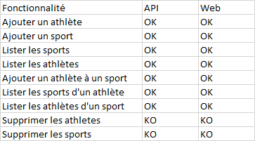

# jeuxOlympiques
Projet TP1 administration JO, M2 Nodejs

Prise en main du projet : 
    
Cloner le repo et faire un npm init à la racine du projet pour télécharger toutes les dépendances.
    
Ensuite lancer "npm start" (toujours à la racine su projet). 

Le serveur tourne sur le port 3001.
    
Ouvrir un navigateur et se rendre sur ladresse http://localhost:3001/.
    
La page web s'affiche avec les fonctionnalités disponible.

Notes :

Des optimisations sont encore à apporter au projet mais voici quelques recommandations afin d'y palier pour l'instant :
    
A chaque modification (ajout d'athlète ou de sport, sport à athlète...etc) un chargement de la page sera
    nécessaire pour pouvoir les lister.
    
Le traitement des données "doublons" n'est pas pris en charge dans cette version du projet, en conséquence
    les actions d'ajouts peuvent etre rejouées à multiple reprise (ex: ajouter l'athlete christiano ronaldo 10x dans la bdd "athlete").

Checklist API :

